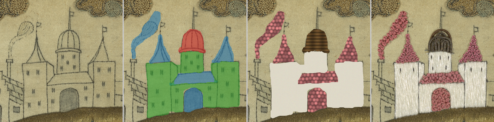

# Digitally Reintegrating Losses in Heritage Embroidery

Code, sample data, and trained adapters for the GCH 2026 paper
*Digitally Reintegrating Losses in Heritage Embroidery* (Eurographics
Workshop on Graphics and Cultural Heritage, 2026).

**Project page & interactive demos:** https://geojenks.github.io/digitally-reintegrating-losses/



## What this is

A method for digitally reintegrating losses in embroidered heritage
textiles that is deliberately independent of any single generative
model. Small LoRA adapters encode individual stitch structures(
**satin stitch**, **french knot**, **silk purl**) from photographs of
17th-century English embroideries. They are deployed on
inpainting/instruction-edit variants of contemporary diffusion model
families (SDXL, FLUX.1, Qwen-Image-Edit). Best resutls when fills are
conditioned on **procedural texture initiations** with features that
approximate the output texture (knot bumps, parallel satin threads,
coiled purl) so the model restyles a structurally-correct starting
point rather than inventing one, but can be plain or language (CLIP)
drive with full denoising set to 1.

Verification happens in **surface-normal space**: a Marigold monocular
normal estimator fine-tuned on 11,813 RTI tiles of the same corpus
converts each fill to a normal map, and seven training-free surface
descriptors are compared by Mahalanobis distance to the descriptor
cloud of real stitches of the prescribed type. A faithful fill
reproduces the craft surface structure of the stitch type, not the
exact thread positions of the lost original. This monocular surface
estimator should work on any images of embroidery with comparable
features, so is generalisable to unseen embroidery techniques.

Everything can run locally on a single consumer GPU, but commercial
(rented) GPUs may be more viable for larger models, or for people
without access to a powerful consumer GPU, e.g. GPU power to train
a LoRA and generate fills may be paid for on Huggingface.

## Repository layout

| Path | Contents |
|---|---|
| `pipeline/` | The full pipeline: staged reintegration, holdout evaluation, normal estimation, surface descriptors, Mahalanobis scoring, mask tools |
| `training/configs/` | The exact [ai-toolkit](https://github.com/ostris/ai-toolkit) configs the released LoRAs were trained with |
| `training/TRAINING_TO_INFERENCE.txt` | Which base each LoRA was trained on, and which model to load it onto at inference |
| `data/stitches/` | 20 sample training images + captions per stitch (satin, french knot, silk purl), plus the trigger-only caption variants |
| `data/tiles_sample/` | Matched colour/normal RTI tile pairs (768×768) from the Marigold fine-tuning set. 12 pairs here, a 100-pair zip on the release, full 13,551-pair set on Zenodo |
| `data/masks/` | The castle demonstration piece and its per-stitch loss masks |
| `models/` | Where LoRA weights go, see [models/README.md](models/README.md) for downloads |
| `demo/` | The per-region variant picker (static HTML) |
| `notebooks/` | Colab notebook: generate your own stitch textures with SDXL on a free GPU |
| `media/` | Result images and parameter-sweep strips |

## Quick start

```bash
git clone https://github.com/geojenks/digitally-reintegrating-losses
cd digitally-reintegrating-losses
pip install -r requirements.txt
```

Download the stitch LoRAs from the
[latest release](https://github.com/geojenks/digitally-reintegrating-losses/releases)
and place each file at `output/<run_name>/<run_name>.safetensors`
(the layout `pipeline/staged_reintegrate.py` expects), e.g.

```
output/satin_stitch_sdxl_lora_v1/satin_stitch_sdxl_lora_v1.safetensors
```

### Base models

None of the base models are redistributed here; download them from
their own homes and accept their licences:

| Model | Where | Notes |
|---|---|---|
| SDXL base / inpaint | [stabilityai/stable-diffusion-xl-base-1.0 (SDXL)](https://huggingface.co/stabilityai/stable-diffusion-xl-base-1.0) |  GB VRAM (over 12 recommended) |
| FLUX.1-dev | [black-forest-labs/FLUX.1-dev](https://huggingface.co/black-forest-labs/FLUX.1-dev) (accept the licence) | set `FLUX_DEV_SAFETENSORS` to the file; ~24 GB VRAM |
| FLUX.1-Fill-dev | [black-forest-labs/FLUX.1-Fill-dev](https://huggingface.co/black-forest-labs/FLUX.1-Fill-dev) | set `FLUX_FILL_SAFETENSORS` |
| Qwen-Image-Edit | [Qwen/Qwen-Image-Edit-2511](https://huggingface.co/Qwen/Qwen-Image-Edit-2511) | set `QWEN_EDIT_SAFETENSORS`; fp8-quantised on load |

`pipeline/predownload_models.py` pre-fetches the hub components.

### Reintegrate the castle demo

The settled recipe from the paper (FLUX.1-dev, trigger-only LoRAs,
procedural inits, per-region variants):

```bash
python pipeline/staged_reintegrate.py \
  --image data/masks/castle.png --masks data/masks \
  --model flux_base --lora_variant trigonly_v2 --size 1024 \
  --per_region --region_max_up 2 --tex_proc --proc_knot_r 16 \
  --brim 10 --sib_feather 3 \
  --denoise 0.6 --denoise_french_knot 0.65 --denoise_satin 0.5 --denoise_silk_purl 0.8 \
  --region_variants 8 --seed 1600 --out staged_out
```

On a smaller GPU, swap `--model flux_base --lora_variant trigonly_v2`
for `--model sdxl_base --lora_variant v1`, or use the
[Colab notebook](notebooks/generate_textures_colab.ipynb), which runs
the SDXL route on a free T4.

`--proc_knot_r`, `--proc_satin_thread`, `--proc_satin_angle`,
`--proc_satin_angle_step`, `--proc_coil` and the `--proc_col_<stitch>`
overrides control the procedural init (knot radius, satin thread width
and angle, purl coil pitch, colourway); `--paste_only` previews the
inits with no model loaded. `--region_variants N` generates N options
per loss region and `demo/region_picker.html` lets you assemble the
final composite by eye.

### Verify a fill

```bash
python pipeline/generate_type_normals.py      # fills -> surface normals (fine-tuned Marigold)
python pipeline/classical_surface_descriptors.py
python pipeline/distance_to_real.py           # Mahalanobis distance to the real-stitch cloud
```

The fine-tuned Marigold normals checkpoint (~3.5 GB) and the full
13,551-pair tile set are on Zenodo, split over two records: the
checkpoint and colour tiles in
[10.5281/zenodo.22828363](https://doi.org/10.5281/zenodo.22828363),
the normal-map tiles in
[10.5281/zenodo.22920709](https://doi.org/10.5281/zenodo.22920709).

## Training your own stitch LoRA

The released adapters were trained with
[ostris/ai-toolkit](https://github.com/ostris/ai-toolkit) using the
configs in `training/configs/` (43–90 images per stitch, trigger words
`embstn` / `embfnchknt` / `embslkprl`). `data/stitches/` holds 20
sample image+caption pairs per stitch so you can see the captioning
style, including the trigger-only variants used for the v2 FLUX
adapters. To reintegrate a stitch type we don't cover, photograph
30–90 clean examples, caption them, pick a fresh trigger token, and
train with the matching config as a starting point.
`training/TRAINING_TO_INFERENCE.txt` maps each training base to its
inference target.

## Data licence and provenance

The photographs derive from RTI captures of 17th-century English
embroideries from a collection held by our collaborators at the
Holburne Museum, Bath, in the United Kingdom. Samples in `data/`
and the Zenodo deposit are released for educational and academic
use. Code is MIT-licensed (see `LICENSE`).

## Citation

```bibtex
@inproceedings{reintegrating-losses-2026,
  title     = {Digitally Reintegrating Losses in Heritage Embroidery},
  booktitle = {Eurographics Workshop on Graphics and Cultural Heritage (GCH)},
  year      = {2026},
  note      = {To appear}
}
```
